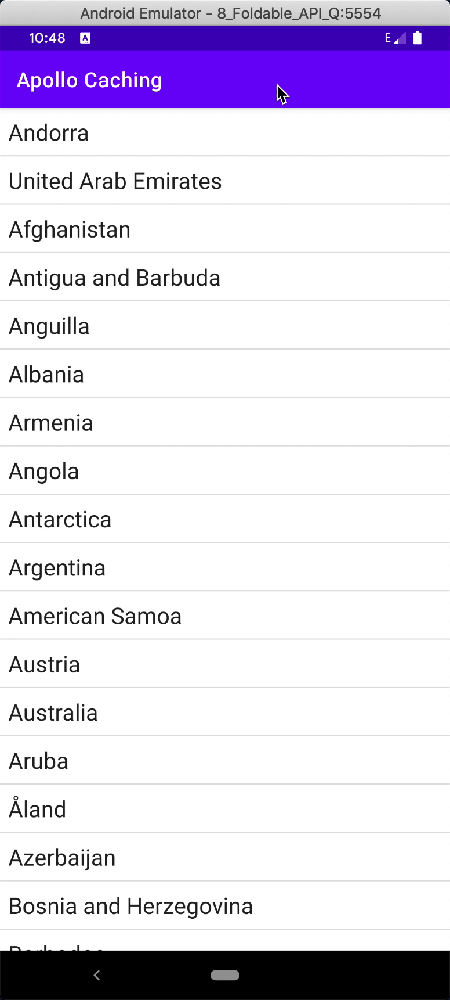
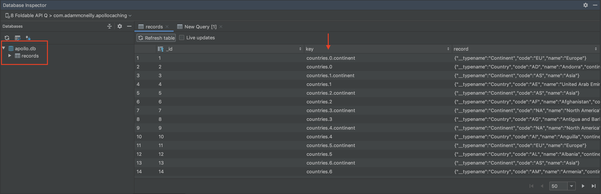

slidenumbers: true
autoscale: true
footer: @AdamMc331<br/>#ApolloDayMobile
build-lists: true

## Caching With Apollo Android

### Adam McNeilly - @AdamMc331

---

# What Is A Cache?

---

> A cache is the storage of data that has been requested previously, so that we can serve it faster in the future.

---

# Why Do We Cache Data?

1. A faster page load leads to better user experience.
2. Checking for data on device can save on networking resources. 

---

# Without Caching



---

# With Caching


---

# Apollo Has Two Types Of Caches

1. HTTP Cache
2. Normalized Cache

---

# HTTP Cache

> The HTTP cache is easier to set up but also has more limitations. [^1] [^2]

[^1]: https://www.apollographql.com/docs/android/essentials/http-cache/

[^2]: https://github.com/apollographql/apollo-android/blob/main/apollo-http-cache/src/main/java/com/apollographql/apollo/cache/http/internal/DiskLruCache.java#L84

---

# How It Works

1. The HTTP cache uses a file directory on the device.
2. With each request, we generate a unique key for the cache. 
3. We store the response of that request in the file directory, 
using that key as the file name. 
4. The next time we make that request, 
Apollo checks to see if there's a file 
with this cache key, and returns the response 
from that file if we do. 

---

# Setup HTTP Cache

1. Create directory for cache.
2. Set maximum size for cache.
3. When the maximum size is reached, Apollo begins to remove the oldest entries.

---

# Setup HTTP Cache

```
val file = File(applicationContext.cacheDir, "apolloCache")

// 1 MB =  1024 X 1024 X 1
val sizeInMegabytes = BYTES_PER_KILOBYTE * KILOBYTES_PER_MEGABYTE * 1

val cacheStore = DiskLruHttpCacheStore(file, sizeInMegabytes)

val apolloCache = ApolloHttpCache(cacheStore)
```

---

# Setup Apollo Client

```
ApolloClient.builder()
    .httpCache(apolloCache)
    .build()
```

---

# HttpCachePolicy

1. NETWORK_ONLY
2. CACHE_ONLY
3. NETWORK_FIRST
4. CACHE_FIRST

---

# Setting Default Cache Policy 

```
val apolloClient = ApolloClient.builder()
    // ...
    .defaultHttpCachePolicy(HttpCachePolicy.CACHE_FIRST)
    .build()
```

---

# Setting Cache Policy Per Query

```
val cacheFirstQuery = apolloClient
    .query(query)
    .toBuilder()
    .httpCachePolicy(HttpCachePolicy.CACHE_FIRST)
    .build()
```

---

# Invalidating HTTP Cache

```
// Set expiration policy
val oneHourPolicy = HttpCachePolicy.CACHE_FIRST.expireAfter(1, TimeUnit.HOURS)

val removeAfterRead = HttpCachePolicy.CACHE_FIRST.expireAfterRead()

// Clear manually
apolloClient.clearHttpCache()
```

---

# What Are The Limitations?

1. If multiple operations request similar information, the HTTP cache will store it twice. 
2. We cannot observe changes to the HTTP cache. 
3. It does not work well with HTTP Post requests. 

---

# Normalized Cache

> The normalized cache stores information by ID. This allows us to relate responses from different queries to each other. [^3]

[^3]: https://www.apollographql.com/docs/android/essentials/normalized-cache/

---

# Two Types Of Normalized Caches

1. In Memory
2. SQLite Database

---

# Creating In Memory Normalized Cache

1. Define eviction policy.
2. Create cache factory. 

---

# Creating In Memory Normalized Cache

```
val evictionPolicy = EvictionPolicy.builder()
    .maxSizeBytes(...)
    .expireAfterAccess(...)
    .expireAfterWrite(...)
    .maxEntries(...)
    .build()

val cacheFactory = LruNormalizedCacheFactory(evictionPolicy)

val apolloClient = ApolloClient.builder()
	.normalizedCache(cacheFactory)
	.build()
```

---

# Creating SQLite Normalized Cache

```
val cacheFactory = SqlNormalizedCacheFactory(applicationContext, "apollo.db")

val apolloClient = ApolloClient.builder()
	.normalizedCache(cacheFactory)
	.build()
```

---

# Chaining Normalized Caches

```
// Pulling from memory is faster than reading from disk.
// Chaining caches can give us the best of both approaches -
// the speed of RAM while still persisting data.
val inMemoryCache = ...
val sqliteCache = ...

val memoryThenSqliteCache = inMemoryCache.chain(sqliteCache)

val apolloClient = ApolloClient.builder()
	.normalizedCache(memoryThenSqliteCache)
	.build()
```

---

# ApolloResponseFetchers 

1. CACHE_ONLY
2. NETWORK_ONLY
3. CACHE_FIRST
4. NETWORK_FIRST
5. CACHE\_AND\_NETWORK [^4]

[^4]: https://github.com/apollographql/apollo-android/blob/main/apollo-runtime/src/main/java/com/apollographql/apollo/fetcher/ApolloResponseFetchers.java

---

# Setting Response Fetcher

```
// Default for client
val apolloClient = ApolloClient.builder()
    // ...
    .defaultResponseFetcher(ApolloResponseFetchers.CACHE_FIRST)
    .build()

// Setting per call
val cacheFirstQuery = apolloClient
    .query(query)
    .toBuilder()
    .responseFetcher(ApolloResponseFetchers.CACHE_FIRST)
    .build()
```

---

# Debugging And Optimizing Cache

---

# Adding Logger To Apollo Client [^5]

```
val apolloClient = ApolloClient.builder()
	.logger(ApolloAndroidLogger())
	.build()
```

[^5]: https://github.com/apollographql/apollo-android/releases/tag/v2.5.2

---

# Using Logcat To Verify Experience

```
// App loads up.
// This is expected. 
D/ApolloAndroidLogger: Cache MISS for operation CountryListQuery

// We click on a country list item.
// Was this miss expected?
D/ApolloAndroidLogger: Cache MISS for operation CountryDetailQuery
```

---

# This Is Unexpected

The country list screen requests the same information as the country detail screen. We would expect, using the normalized cache, that the detail screen would be able to find the information it needs. Let's try to find out why. 

---

# Logcat Error

```
E/ApolloAndroidLogger: Failed to read cache response
    CacheMissException: Missing value: country for Record(key='QUERY_ROOT', fields={...}, ...)
```

According to Apollo, it was unable to find the record we wanted to display on the detail screen. Let's see if we can figure out why it wasn't there.

---

# Option 1: Print The Normalized Cache

```
private fun printNormalizedCache() {
    val normalizedCacheDump = apolloClient.apolloStore.normalizedCache().dump()
    val formattedDump = NormalizedCache.prettifyDump(normalizedCacheDump)
    Log.d("ApolloNormalizedCache", formattedDump)
}
```

---

# Option 1: Print The Normalized Cache

```
D/ApolloNormalizedCache: OptimisticNormalizedCache {}
    LruNormalizedCache {}
    SqlNormalizedCache {
      // ...
    
      // The record is here! Let's search for Andorra elsewhere in the logs. 
      "countries.0" : {
        "__typename" : Country
        "code" : AD
        "name" : Andorra
        // ...
      }
    
      // ...
    }
```

---

# Option 1: Print The Normalized Cache

```
// We found the record! This is from the detail query response.
"country({"code":"AD"})" : {
  "__typename" : Country
  "code" : AD
  "name" : Andorra
  "continent" : CacheRecordRef(country({"code":"AD"}).continent)
  "capital" : Andorra la Vella
  "emoji" : 🇦🇩
}
```

---

# Option 1: Print The Normalized Cache

```
// Notice the different identifiers!
"countries.0" : {
  // ...
}

"country({"code":"AD"})" : {
  // ...
}
```

---

# More On That Later

---

# Option 2: Database Inspector

If you're using Android Studio, and using the SqlNormalizedCache, we can leverage the new database inspector.

---

# Option 2: Database Inspector



---

# Option 2: Database Inspector


---

# Why Was The Key Different?

By default, Apollo uses the field path as the key. To change this, we can supply our own `CacheKeyResolver`.

---

# CacheKeyResolver

```
val cacheKeyResolver = object : CacheKeyResolver() {
    override fun fromFieldArguments(...): CacheKey {
        // This is called when each query is run. We use this to
        // resolve query arguments to the key that we want to find. 
    }

    override fun fromFieldRecordSet(...): CacheKey {
        // This is called when an operation returns. We use this
        // to resolve the response to the cache key we want
        // to save. 
    }
}
```

---

# Apply Resolver To Apollo Client

```
val apolloClient = ApolloClient.builder()
	.normalizedCache(cacheFactory, cacheKeyResolver)
	.build()
```

---

# Mapping Object IDs To Key

```
override fun fromFieldRecordSet(
    field: ResponseField,
    recordSet: Map<String, Any>
): CacheKey {
    val codeProperty = recordSet["code"] as String
    val typePrefix = recordSet["__typename"] as String
    return CacheKey.from("$typePrefix.$codeProperty")
}
```

---

# Database Inspector


---

# Mapping Arguments To Key

```
override fun fromFieldArguments(
    field: ResponseField,
    variables: Operation.Variables
): CacheKey {
	// When we are querying for a country, let's create the CacheKey to
	// see if that country exists already.
    return if (field.fieldName == "country") {
        val codeProperty = field.resolveArgument("code", variables) as String
        val fullId = "Country.$codeProperty"
        CacheKey.from(fullId)
    } else {
        CacheKey.NO_KEY
    }
}
```

---

# Let's Run The App!

```
// When we load the app.
// This miss is expected.
D/ApolloAndroidLogger: Cache MISS for operation CountryListQuery

// When we clicked on an item, we hit the cache!
D/ApolloAndroidLogger: Cache HIT for operation CountryDetailQuery
```

---

# Important!

This will only work if the detail screen is requesting the same, or fewer, fields as the main screen. If the cache doesn't have the properties we need, this will go to the network. 

---

# Responding To Cache Changes

We can leverage the coroutine or RxJava adapters to any queries that might interract with the cache, to be notified if our data changes:

```
apolloClient
    .query(query)
    .toFlow()
    .collect { response ->
        // Handle response.
    }
```

---

# Pulling From Cache And Network

This is really helpful when paired with the `ApolloResponseFetcher.CACHE_AND_NETWORK`. It will emit what was in the cache, and the response from the network.

```
apolloClient
    .query(query)
    .toBuilder()
    .responseFetcher(ApolloResponseFetchers.CACHE_AND_NETWORK)
    .build()
    .toFlow()
    .collect { response ->
        // Will emit twice.
    }
```

---

# Thanks!

Questions? - https://twitter.com/AdamMc331

Sample Project - https://github.com/AdamMc331/ApolloCaching